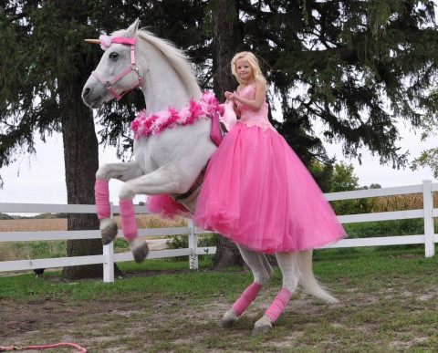

# Dancing Horse

### Please add good detection images for testing

- You can crop gif file at [Link to URL](https://ezgif.com/crop)

## Usage

1. Open the html file with Window Browser(e.g. Chrome)

2. Set the parameter according to your environment.  

>we had been set the some parameter values as default, however, you can change input value according to your environment.
> - Start Size: the size of images when it start to move.
> - End Size: the size of the images when it arrived to the end of the browser.
> * (e.g. If you set start size: 300, and end size as 500, images becomes bigger inclemently in each duration.)
> - Height(Start/End): Height of the images when start and end.
> - Speed(ms):speed of the images move in each duration.
3. Press 'Start'

## TODO (Improvements)

1. Change target's speed irregularly.

